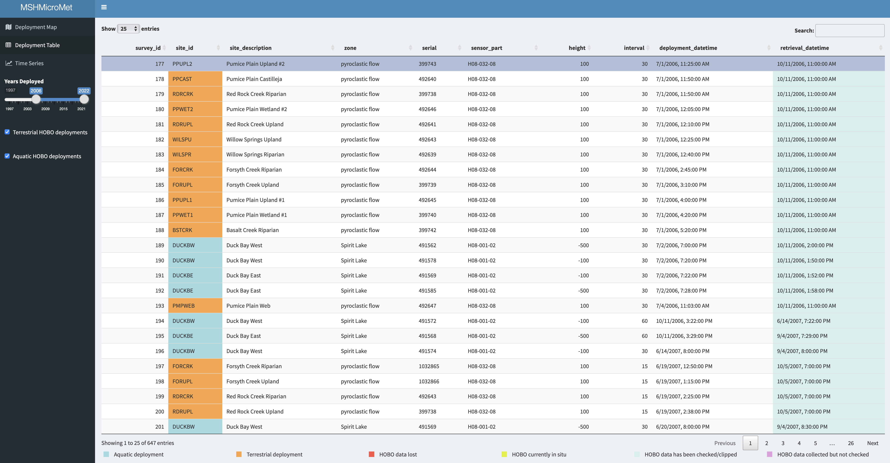

```{r setup, include=FALSE}
knitr::opts_chunk$set(echo = TRUE)
```

[](https://zenodo.org/badge/latestdoi/561350602)


`MSHMicroMetR` is an R package used to access and visualize microscale temperature and relative humidity measurements collected between 1997-2022 
by the US Forest Service Pacific Northwest Research Station throughout the Mount St. Helens post-1980 eruption landscape.

The package contains 2 data frames and 1 R Shiny app:

* `MSHMicrometHeader` - data frame containing metadata for microscale meteorology HOBO deployments on Mount St. Helens
* `MSHMicrometData` - data frame containing microscale temperature and relative humidity measurements from HOBO deployments on Mount St. Helens
* `microMetViz` - R shiny app for visualizing HOBO deployment location, metadata, and time series of temperature and relative humidity measurements

### Installation

You can install the latest version from Github with:

```{r, eval = FALSE}
install.packages('remotes')
remotes::install_github("CCheCastaldo/MSHMicroMet", subdir = "MSHMicroMetR")
```

### How to cite these data

Che-Castaldo, C., and C.M. Crisafulli. 2022. "Long-Term Monitoring of Mount St. Helens Micrometeorology." *Ecology* e3950. https://doi.org/10.1002/ecy.3950

### Supporting information for these data

Supporting information for these data can be found in the [MetadataS1.pdf](https://esajournals.onlinelibrary.wiley.com/action/downloadSupplement?doi=10.1002%2Fecy.3950&file=ecy3950-sup-0001-DataS1.zip) associated with this paper.

### Acknowledgments

Financial support for this work was provided by the Pacific Northwest Research Station, US Forest Service and the U.S. National Science Foundation, Grant Numbers DEB-1257360 and DEB-0614538.

### R Shiny app

Visualizing data from `MSHMicroMetR` is easily done using the `microMetViz` R Shiny app. The app includes a customizable leaflet map of all HOBO deployments, color coded by habitat (blue = aquatic and orange = terrestrial), on the Deployment Map tab. The map is subsettable by years of deployment and habitat.

```{r, eval = FALSE}
MSHMicroMetR::microMetViz()
```

<p align="center">
```{r, echo = FALSE, out.width = "100%", fig.align = 'center'}
knitr::include_graphics("MSHMicroMetR/logo/leaflet_map.png")
```
</p>

Metadata for the mappped HOBO deployments can be accessed on the Deployment Table tab.

<p align="center">
```{r, echo = FALSE, out.width = "100%", fig.align = 'center'}

```
</p>

You can visualize the time series of temperature and relative humidity measurements for any individual deployment by selecting it on the table and then clicking on the Time Series tab.

<p align="center">
```{r, echo = FALSE, out.width = "100%", fig.align = 'center'}
knitr::include_graphics("MSHMicroMetR/logo/dygraph.png")
```
</p>

<br>
