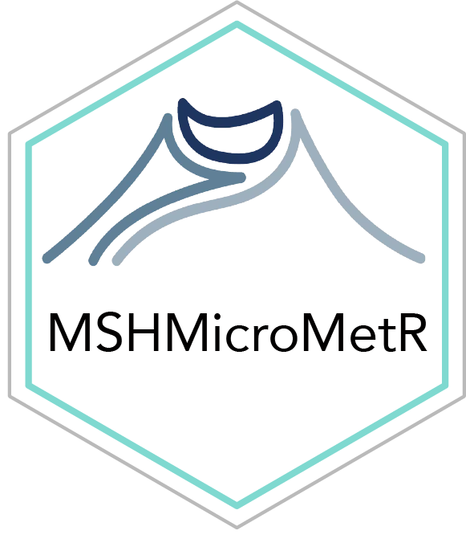
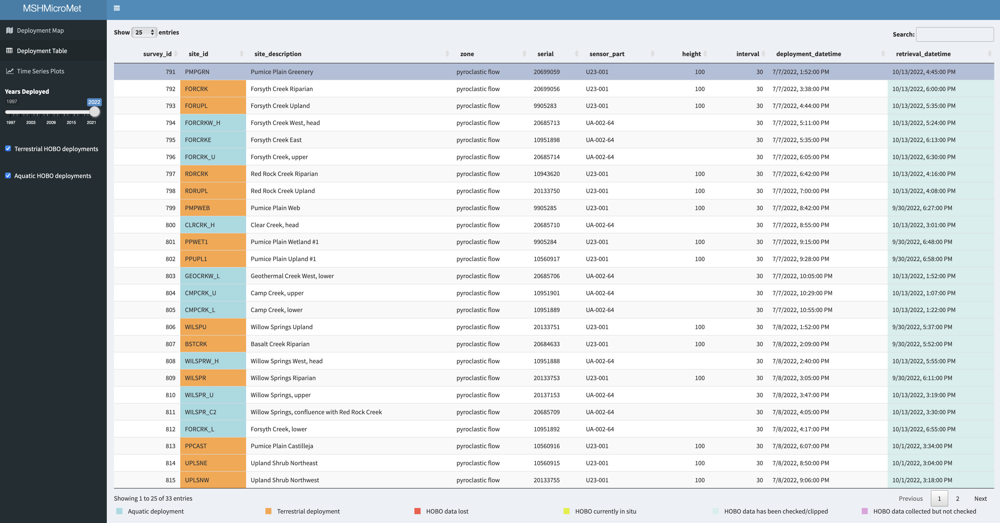
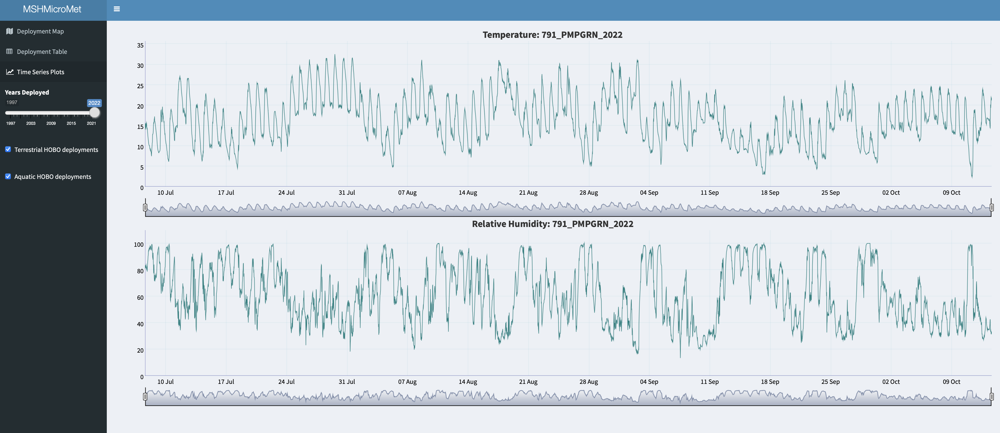

Mount St. Helens Micrometeorology Data for R
================



`MSHMicroMetR` is an R package for accessing and visualizing microscale
temperature and relative humidity measurements collected between
1997-2022 by the US Forest Service Pacific Northwest Research Station
throughout the Mount St. Helens post-1980 eruption landscape.

The package contains 2 data frames and 1 R Shiny app:

-   `MSHMicrometHeader` - data frame containing metadata for microscale
    meteorology HOBO deployments on Mount St. Helens
-   `MSHMicrometData` - data frame containing microscale temperature and
    relative humidity measurements from HOBO deployments on Mount
    St. Helens
-   `microMetViz` - R shiny app for visualizing HOBO deployment
    location, metadata, and time series of temperature and relative
    humidity

### Installation

You can install the latest version from Github with:

``` r
install.packages('remotes')
remotes::install_github("CCheCastaldo/MSHMicroMet", subdir = "MSHMicroMetR")
```

### Supporting Information for these data

Link to Metadata_S1 file from Data Paper

### How to cite these data

Citation info and link to Data Paper in Ecology

### Acknowledgments

Financial support for this work was provided by the Pacific Northwest
Research Station, U.S. Forest Service and the U.S. National Science
Foundation, Grant Numbers DEB-1257360 and DEB-0614538.

### R Shiny app

Visualizing data from `MSHMicroMetR` is easily done using the
`microMetViz` R shiny app. The app includes a leaflet map of all HOBO
deployments, color coded by habitat (blue = aquatic and orange =
terrestrial), on the Deployment Map tab. The map is subsettable by years
of deployment and habitat.

``` r
MSHMicroMetR::microMetViz()
```

<p align="center">

</p>

Metadata for the mappped HOBO deployments can be accessed on the
Deployment Table tab.

<p align="center">

</p>

You can visualize the time series of temperature and relative humidity
for any individual deployment by selecting it on the table and then
clicking on the Time Series tab.

<p align="center">

</p>

<br>
