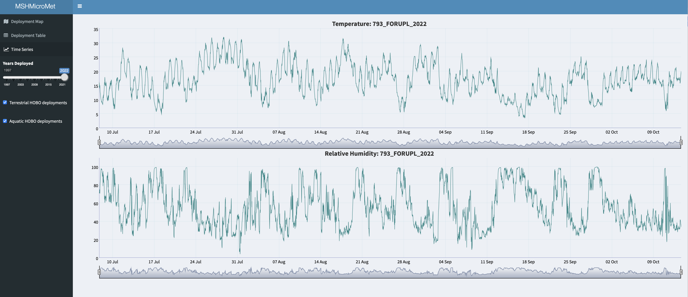

README
================

### Mount St. Helens Micrometeorology data for R

<a href="http://www.penguinmap.com"></a>

`MSHMicroMetR` is an R package used to access and visualize microscale
temperature and relative humidity measurements collected between
1997-2022 by the US Forest Service Pacific Northwest Research Station
throughout the post-1980 Mount St. Helens eruption landscape.

The package contains 2 data frames and 1 R Shiny app:

-   `MSHMicroMetHeader` - data frame containing metadata for microscale
    meteorology HOBO deployments on Mount St. Helens
-   `MSHMicroMetData` - data frame containing microscale temperature and
    relative humidity measurements from HOBO deployments on Mount
    St. Helens
-   `microMetViz` - R shiny app for visualizing HOBO deployment
    location, metadata, and time series of temperature and relative
    humidity

### Installation

You can install the latest version (1.0) from Github with:

``` r
install.packages('remotes')
remotes::install_github("CCheCastaldo/MSHMicroMet", subdir = "MSHMicroMetR")
```

### Supporting Information for these data

Link to Metadata_S1 file

### How to cite these data

Citation info and link to Data Paper in Ecology

### Acknowledgments

Financial support for this work was provided by the Pacific Northwest
Research Station, U.S. Forest Service and the U.S. National Science
Foundation, Grant Numbers DEB-1257360 and DEB-0614538.

### R shiny viewer

Visualizing data from `MSHMicroMetR` is easily done using `micrometViz`,
which includes a leaflet map of HOBO deployments, color coded by habitat
(blue = aquatic and orange = terrestrial), on the Deployment Map tab
that is subsettable by years of deployment and habitat.

<p align="center">

</p>

Metadata for the mappped HOBO deployments can be accessed on the
Deployment Table tab.

<p align="center">

</p>

By selecting an individual deployment from the table you can visualize
the timer series of temperature and relative humidy (if applicable) on
the Time Series Plots tab.

<p align="center">

</p>

<br>
